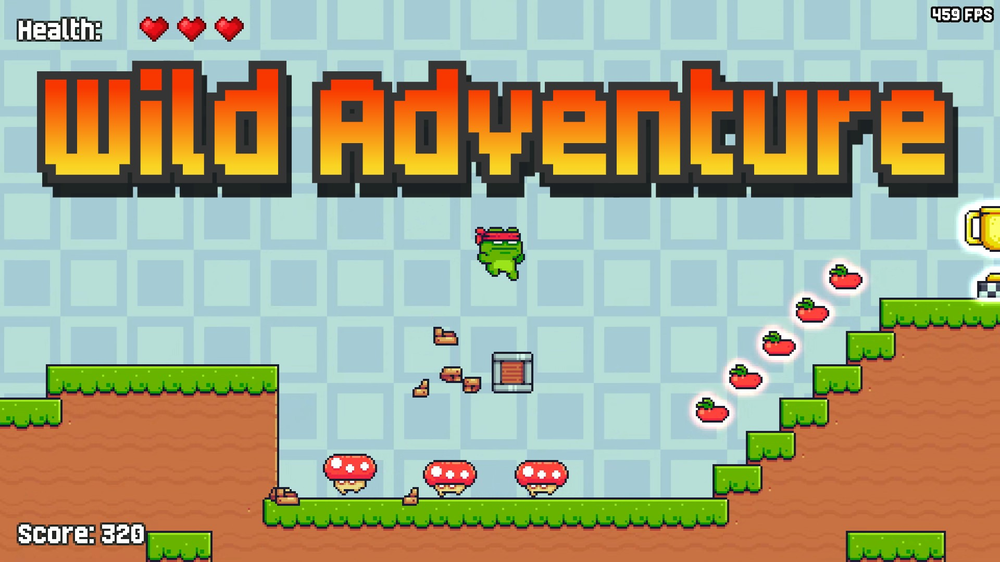
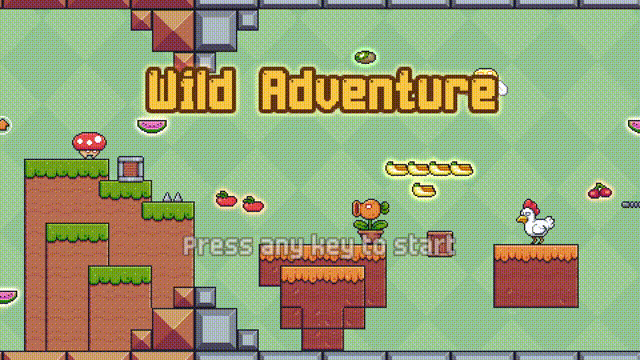
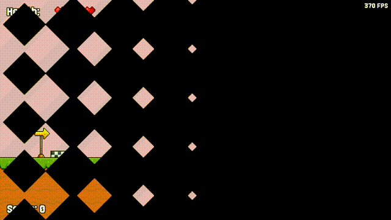
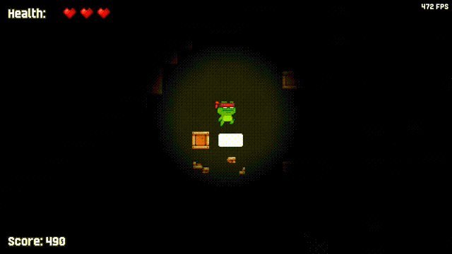
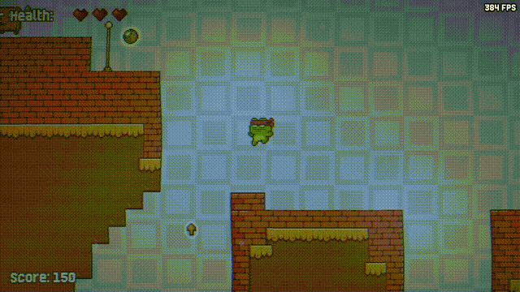

<h1 align="center">Wild Adventure</h1>

<p align="center">
  A handcrafted pixel-art 2D platformer — C++23 / SFML 3.1, a custom sparse-set ECS.
</p>

<p align="center">
  
  
  
  
  
  
</p>

<p align="center">
  <a href="https://demianblogan.itch.io/wild-adventure"><b>▶ Play on itch.io</b></a>
  &nbsp;·&nbsp;
  <a href="https://github.com/demianblogan/Wild_Adventure/releases/latest">Latest release</a>
  &nbsp;·&nbsp;
  <a href="https://www.youtube.com/watch?v=5fMzVaFlBoQ">Full playthrough</a>
</p>

<p align="center">
  
</p>

---

## What it is

A hand-built platforming campaign across 7 handcrafted levels: run, jump, double-jump and wall-slide past 9 enemy types and environmental traps, smash crates for fruit, and chase a clean 3-star clear — no deaths, every fruit, every enemy — on the way to unlocking one of 4 playable skins. Built from scratch on a custom sparse-set Entity-Component-System.

<table align="center">
  <tr>
    <td align="center"><br><sub>Main menu</sub></td>
    <td align="center"><br><sub>Gameplay</sub></td>
  </tr>
  <tr>
    <td align="center"><br><sub>Cave level</sub></td>
    <td align="center"><br><sub>Water level</sub></td>
  </tr>
</table>

<p align="center">
  <a href="https://www.youtube.com/watch?v=5fMzVaFlBoQ">
    
  </a>
  <br>
  ▶️ <a href="https://www.youtube.com/watch?v=5fMzVaFlBoQ"><b>Watch the full playthrough</b></a>
</p>

---

## Download & play

- **[Play on itch.io](https://demianblogan.itch.io/wild-adventure)** — store page with screenshots
- **[Download the latest release from GitHub](https://github.com/demianblogan/Wild_Adventure/releases/latest)**

1. Download `Wild Adventure.zip`
2. Extract it anywhere
3. Run `WildAdventure.exe` — the SFML DLLs are bundled next to it

Windows 10 / 11, 64-bit. A gamepad is optional; Xbox and PlayStation (DualSense /
DualShock) layouts are built in and switched to automatically, with full
DualSense rumble and lightbar support.

---

## Features

### Gameplay
- 7 handcrafted platforming levels, each with its own visual theme — including
  a dark cave level lit only around the player, and a floaty underwater one
- 9 enemy types with distinct AI: flyers, ground patrols, a chaser, shooters, a
  snail that splits into a kickable shell on the first hit, and a turtle
  that's only vulnerable with its spikes retracted
- 4 trap types (spring/arrow launchers, timed fire plates, sliding crush
  blocks, trampolines) plus static spike hazards
- Destructible fruit crates, a checkpoint system, and a three-star rating per
  level (no deaths / all fruits / all enemies killed)
- Campaign progression with full-completion tracking and 4 unlockable
  character skins, plus a one-time end-of-campaign victory scene

### Input & feedback
- Full keyboard, Xbox and PlayStation (DualSense / DualShock) support with
  automatic device switching
- Xbox rumble and DualSense rumble + lightbar, independently tuned for menu
  clicks, damage, landing, footsteps, pickups, checkpoints, hazards, and the
  finish-cup fanfare — never just "louder or quieter", each event gets its own
  motor blend and lightbar color
- The DualSense lightbar tracks your hearts during gameplay (green → orange →
  red, pulsing red in time with your heartbeat on the last one) and rests on a
  warm color in menus, flashing briefly on every click
- Fully rebindable keyboard controls; every menu is navigable start to finish
  on a gamepad alone

### Visuals & audio
- Pixel-art graphics with animated characters, enemies and particle effects
- A trauma-based camera shake, a pulsing low-health screen vignette, and a
  brief hit-stop freeze on stomping an enemy — each independently toggleable
- Dynamic sound effects and a full background music system
- Localized into 5 languages: English, Spanish, German, Russian, Ukrainian

### Settings
Configurable from both the Main Menu and the Pause Menu — **Graphics**
(resolution, screen mode, V-Sync, FPS counter), **Audio** (music / sound
volume), **Gameplay** (vibration, controller light, low-health vignette,
hit-stop, camera shake), **Controls** (keyboard rebinding), **Language**.
Everything is saved and restored automatically between sessions.

Full breakdown: **[docs/GAMEPLAY.md](docs/GAMEPLAY.md)**

---

## Controls

| Action | Keyboard | Xbox | PlayStation |
|---|---|---|---|
| Move | `A` / `D` or `←` / `→` | Left stick / D-pad | Left stick / D-pad |
| Jump / double jump | `Space` | A | Cross (✕) |
| Pause | `Esc` | Menu | Options |
| Menu navigation | Arrow keys | D-pad / left stick | D-pad / left stick |
| Menu confirm | `Enter` | A | Cross (✕) |
| Menu back | `Esc` | B | Circle (◯) |

Move and Jump are fully rebindable in Settings → Controls. Full layouts,
including DualSense rumble / lightbar: **[docs/CONTROLS.md](docs/CONTROLS.md)**

---

## Save data

The game writes per-player data to:

```
%LOCALAPPDATA%\Alone Bull Company\Wild Adventure\
```

| File | Contents |
|---|---|
| `settings.json` | graphics, audio, gameplay, controls and language settings |
| `save.json` | campaign progress (best stars per level), the chosen skin, whether the victory scene has been shown |
| `input.json` | rebound keyboard keys |

If `%LOCALAPPDATA%` is unavailable, the game falls back to a `user_data\`
folder next to the executable. Writes are atomic, and a file that fails to
parse is quarantined as `<name>.corrupt` rather than overwritten.

---

## Building from source

### Requirements
- A C++23-compatible compiler (MSVC / Visual Studio 2022+)
- CMake 3.25+
- [vcpkg](https://github.com/microsoft/vcpkg) (for `nlohmann-json`)
- SFML 3.1.0, built locally — see [libs/SFML/README.md](libs/SFML/README.md).
  vcpkg's own `sfml` port isn't updated past 3.0.2 yet, so SFML is vendored
  separately from the rest of the dependencies.

### Set up the `default` preset

`CMakePresets.json` only defines the shared, machine-independent `base`
preset. The `default` and `release` presets point at *your* local vcpkg
install, so they live in `CMakeUserPresets.json` — a gitignored file you
create once from the example:

```bash
cp CMakeUserPresets.json.example CMakeUserPresets.json
```

Then edit `CMAKE_TOOLCHAIN_FILE` in `CMakeUserPresets.json` to point at
`<your vcpkg checkout>/scripts/buildsystems/vcpkg.cmake`.

### Configure, build, test, run

```bash
cmake --preset default
cmake --build build/default
ctest --test-dir build/default
```

Launch the game from the project root directory so `assets/` and `data/`
resolve correctly.

Prebuilt binaries are on the **[Releases page](https://github.com/demianblogan/Wild_Adventure/releases)**.

---

## Architecture

A hand-rolled state machine over a fixed-timestep SFML render loop — no
engine. Unlike this project's other titles, the scale here (9 enemy types, 4
trap types, a full multi-level campaign) earns a real **sparse-set ECS**:
`Registry::ForEach<Components...>` drives every gameplay system, from physics
and enemy AI to pickups, damage and checkpoints.

Full write-up: **[docs/ARCHITECTURE.md](docs/ARCHITECTURE.md)** · design
patterns used, mapped to the code: **[docs/PATTERNS.md](docs/PATTERNS.md)**

```
src/        game source code (core/ecs, components, systems, level, screens, states, ui, ...)
data/       level maps (Tiled), UI layouts, entity prefabs, JSON configuration
assets/     textures, sounds, music, fonts, shaders
libs/       external libraries (SFML; DualSenseWindows and nlohmann/json, vendored)
```

---

## Tech

C++23 · SFML 3.1.0 · DualSenseWindows · nlohmann/json · CMake · vcpkg · Tiled

## Author

**Demian Blogan** — demianblogan@gmail.com

Licensed under the [MIT License](LICENSE).
