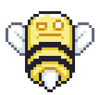
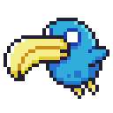
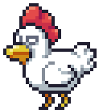
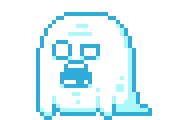
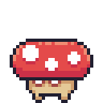
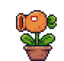
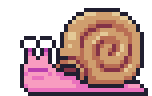
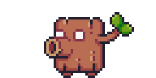
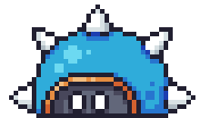

# Gameplay reference

- [Levels](#levels)
- [Enemies](#enemies)
- [Traps & hazards](#traps--hazards)
- [Stars & skins](#stars--skins)
- [Settings](#settings)
- [Save data](#save-data)

---

## Levels

7 handcrafted levels (`Campaign::LevelCount`), each its own Tiled `.tmj` map
under `data/levels/`. A level unlocks once the one before it is completed;
Level 1 is always open. Each has its own scrolling background texture/tint
(`data/levels/backgrounds.json`), and two carry a distinct theme read off the
map itself (`LevelSetup::Theme`):

- **Level 3 — cave.** `data/levels/lighting.json` attaches a soft-edged
  circle of light around the player (radius 90, darkness 0.95) and darkens
  everything else — the rest of the level is only visible near you.
- **Level 6 — water.** Gravity is scaled down (floatier jumps and falls) and
  ambient bubbles trickle up from the bottom of the screen.

---

## Enemies

9 enemy types, each its own AI system under `src/systems/enemies/`. Unless
noted otherwise, a stomp from above kills the enemy outright (a brief freeze,
then it tumbles and falls off-screen — see [ARCHITECTURE.md](ARCHITECTURE.md#gameplay-systems));
anything else (walking into one, its projectile, its shell) deals contact
damage to the player instead.

| Sprite | Enemy | Behavior | Score |
|:---:|---|---|---:|
|  | Bee | Flies a figure-eight patrol around its spawn point; closes in and fires a bullet straight down when the player is nearby. | 25 |
|  | Blue Bird | Flies a straight patrol line (horizontal or vertical), reversing at its configured bounds or on hitting a wall/ceiling. No attack. | 20 |
|  | Chicken | Idles until the player enters its vision box, then runs at them; gives up and returns to idling after losing sight for a moment. | 25 |
|  | Ghost | Cycles visible → disappearing → invisible → appearing; keeps patrolling while invisible, but can only be stomped while visible. | 20 |
|  | Mushroom | A simple ground patroller: walks until it hits a wall or the edge of a platform, pauses, and reverses. | 10 |
|  | Plant | Stationary and one-directional; shoots a horizontal bullet when the player is in front of it, at the same height, and in range. | 20 |
|  | Snail | Ground patroller. The **first** stomp doesn't kill it — it retreats into a shell instead, which then becomes a separate, kickable **Shell** entity: resting until touched, then rolling and bouncing off walls until it's stomped or runs its course. | 15 |
|  | Trunk | Ground patroller that stops to fire a horizontal bullet when the player is in range, then resumes patrolling. | 15 |
|  | Turtle | Stationary, cycling safe → spikes emerging → spiked → spikes retracting. Stomping it while spiked hurts the player instead of killing it — it's only vulnerable during the safe phase. | 20 |

Icons are a single frame cropped from each enemy's idle spritesheet (they're
all multi-frame animations in `assets/textures/enemies/`, not standalone
icon files) and scaled up with nearest-neighbor so the pixel art stays crisp.

---

## Traps & hazards

| Trap | Behavior |
|---|---|
| **Arrow / spring launcher** | Launches the player straight up on contact (keeping their horizontal speed), grants an extra air jump, and despawns after playing its "hit" animation once. |
| **Fire plate** | A floor plate that ignites on contact, plays a brief warm-up, then burns anything standing on it for a set duration before turning back off. |
| **Rock head** | A solid block sliding along one axis; reverses direction when it hits terrain, can carry a rider standing on top, and crushes the player for damage + knockback if they're caught between it and a wall. |
| **Trampoline** | A straightforward bounce pad — launches the player upward and plays its "jump" animation/sound/haptic on every bounce. |
| **Spikes** | A static hazard tile — no animation or state, just damage on contact. |

---

## Stars & skins

Clearing a level always saves progress; the star rating is calculated once,
on that first completion:

| Star | Condition |
|---|---|
| ★ | No deaths during the run |
| ★★ | Every fruit on the level collected |
| ★★★ | Every enemy on the level defeated |

4 character skins unlock as you rack up 3-star clears across the campaign:

| Skin | 3-star levels required |
|---|---:|
| Ninja Frog | 0 (default) |
| Mask Dude | 3 |
| Pink Man | 6 |
| Virtual Guy | 7 (every level) |

---

## Settings

**Graphics** — resolution, Fullscreen / Windowed / Borderless, V-Sync, FPS
counter.

**Audio** — music volume and sound effects volume, independently, in 10
steps.

**Gameplay** — gamepad vibration, DualSense controller light (lightbar),
low-health screen vignette, the hit-stop freeze on stomping an enemy, and
camera shake — each an independent on/off toggle.

**Controls** — full keyboard rebinding for Move and Jump; gamepad bindings
are fixed (see [CONTROLS.md](CONTROLS.md)).

**Language** — English, Spanish, German, Russian, Ukrainian. The first run
opens a one-time language picker before ever reaching the main menu.

---

## Save data

```
%LOCALAPPDATA%\Alone Bull Company\Wild Adventure\
```

| File | Contents |
|---|---|
| `settings.json` | every setting above |
| `save.json` | best stars per level, the selected skin, whether the campaign-victory scene has been shown |
| `input.json` | rebound keyboard keys |

Falls back to a `user_data\` folder next to the executable if
`%LOCALAPPDATA%` isn't available. Writes are atomic; a file that fails to
parse is quarantined as `<name>.corrupt` instead of being overwritten or
silently dropped.
